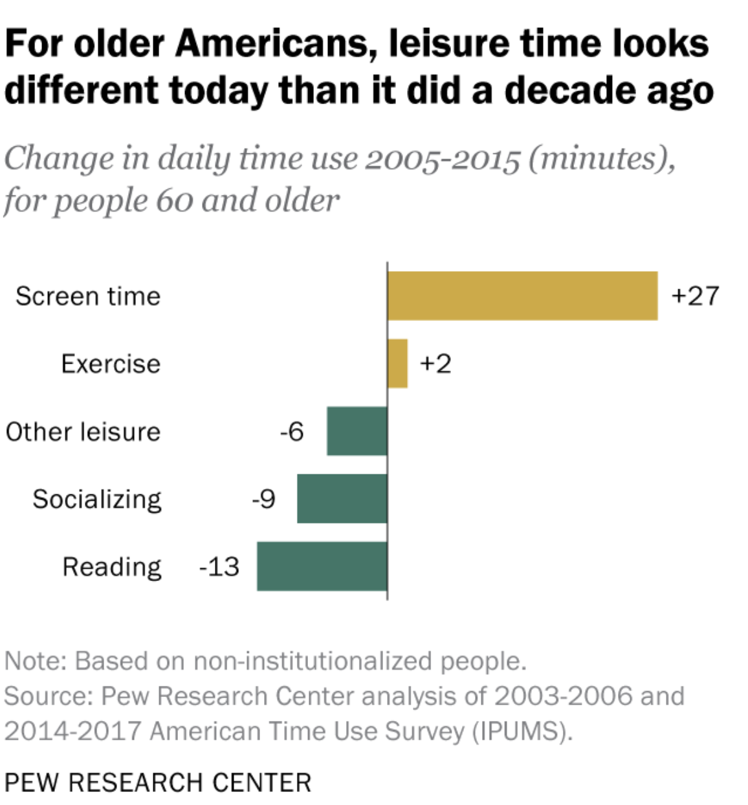

## By: Chelsey L. Brown 
### Summary: I will meet the final project requirements by providing an overview of key computer architecture.  
### Target Audience: The target audience for this project is indiviuals who do not feel confortable when they encourter technology. This website can also be used by anyone who seeks to learn about tech and protect themselves online, as there is a cyber security section to teach you how to keep your information safe while you utilize the internet.The goal is for a beginner to feel safer and a little more familiar with technology 

[Computer Architecture Click here to start!](https://github.com/Chelseyb/IT1600FinalProject/blob/main/page1.md)
   
[Bonus! Check out this link for ways to keep yourself safe online](https://github.com/Chelseyb/IT1600FinalProject/blob/main/page2.md)

     
>Justification: Technology is a huge part of the majority of our lives so it is important that everyone is comfortable and safe online. Technology can be daouting and it is ever chaning but this guide will help you to dip your feet into the water before you dive into the fascinating word of tech! Learn more about the garphic avoce at [Pew](https://www.pewresearch.org/fact-tank/2019/06/18/americans-60-and-older-are-spending-more-time-in-front-of-their-screens-than-a-decade-ago/) .
   
 
