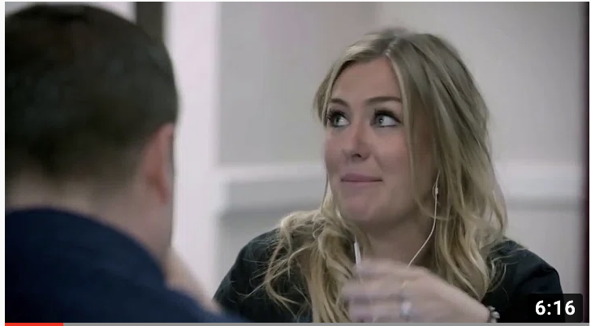

# As a bonus we are going to go over 3 key things you should do to keep yourself safe online 

## Don't think you need to listen? Let me change your mind, here are some examples on what can happen if you are not careful online! **Click on the picture to go to the video   

### Step 1: PROCTECT YOUR PASSWORDS 

* Key Points
  > * Do not use the same password over and over again ESPECIALLY for your banking information 
  > * If you have been hacked to not continue to use the password that was compromised 
  > * Whenever you have the chance to implement two-factor authentication DO IT! This is make it harder for hackers to compromise your accounts 
  > * Consider use a credible password manager. My favorite is [LastPass!](https://www.lastpass.com/)
  
### Step 2: Don't fall for Phishs

 > * A phish is a fake email that has been sent to bait you into clicking on something. Often what you are clicking on will infect your computer. 
 > * Since COVID-19 has many of us communicating via email heavily. It is always best to never click on links in emails unless you can confirm who the email is from. 
 
 
 ## Step 3: Be careful what you download 
 

 > * You have to be careful what you download in order to avoid infecting your computer 
 > * Stay away from sites that do not look well put together 
 > * Also it is always a good idea to have virus protection on your computer 

[Back to home page](https://github.com/Chelseyb/IT1600FinalProject/edit/main/README.md)
